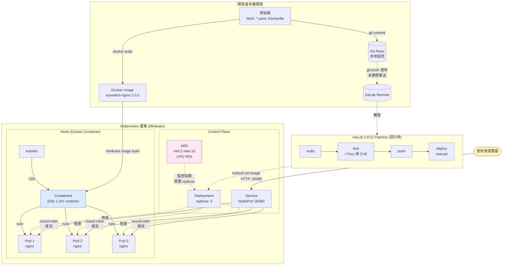

# K8s 靜態網站部署專案

以 Kubernetes 部署自訂 Nginx 容器化靜態網站的完整 DevOps 範例專案。
原為國泰 K8s 面試題，現整合完整的容器化、版本控制、CI/CD 工作流。

---

## 技術棧

| 類別 | 技術 |
|------|------|
| **Version Control** | Git / GitLab |
| **CI/CD** | GitLab CI/CD（build / test / push / deploy 四階段 pipeline）|
| **Containerization** | Docker（建構映像）/ Containerd（K8s 內部 runtime） |
| **Orchestration** | Kubernetes（Minikube 本機叢集） |
| **Web Server** | Nginx 1.27 (Alpine) |
| **Scripting** | PowerShell（本機部署自動化） |
| **Autoscaling** | HorizontalPodAutoscaler（CPU 觸發，2–10 replicas） |

---

## 系統架構



> 圖中虛線表示「設計但本次 demo 未實際執行」的路徑（GitLab push / CI pipeline）。

---

## 專案結構

```
.
├── Dockerfile               # 自訂 Nginx 映像建構腳本
├── .dockerignore            # Docker build context 排除清單
├── .gitignore               # Git 版控排除清單
├── .gitlab-ci.yml           # GitLab CI/CD pipeline 定義
├── html/
│   └── index.html           # 靜態網頁內容（會被 COPY 進映像）
├── deployment.yaml          # K8s Deployment（replicas:3 + 探針 + 資源限制）
├── service.yaml             # K8s Service（NodePort 30080 對外）
├── hpa.yaml                 # HorizontalPodAutoscaler（CPU 50% 觸發擴縮）
├── deploy.ps1               # 本機一鍵部署腳本
├── setup-admin.ps1          # 首次環境安裝腳本（需系統管理員）
├── README.md                # 本檔
├── K8s技術說明.md           # 完整技術解析（含面試題庫）
├── YAML程式碼解說.md        # YAML 逐行註解
├── 作業流程圖.md            # ASCII 流程圖
└── 每次啟動步驟.md          # 日常操作手冊
```

---

## 快速開始

### 前置需求
- Windows 10/11
- Docker Desktop（執行中）
- PowerShell 5.1+

### 一鍵部署
```powershell
cd C:\Users\jason\Desktop\K8s網站
.\deploy.ps1
```

腳本會自動完成：Docker 檢查 → Minikube 啟動（Containerd runtime）→ Docker build → kubectl apply → rollout → 開啟瀏覽器。

詳細步驟見 [每次啟動步驟.md](每次啟動步驟.md)。

---

## DevOps 工作流

### 本機開發
```
編輯 html/index.html
  ↓
minikube image build -t syswatch-nginx:1.0.0 .
  ↓
kubectl rollout restart deployment/nginx-deployment
  ↓
瀏覽器驗證
```

### GitLab CI/CD（push 觸發）
```
git push origin main
  ↓
GitLab Pipeline:
  ① build   - docker build
  ② test    - kubectl --dry-run + Trivy CVE scan
  ③ push    - GitLab Container Registry
  ④ deploy  - kubectl set image + rollout（manual）
```

詳見 [.gitlab-ci.yml](.gitlab-ci.yml) 與 [K8s技術說明.md](K8s技術說明.md) 第九節。

---

## 關鍵設計決策

| 決策 | 為什麼 |
|------|-------|
| HTML 打包進映像，不用 ConfigMap | 配合 image tag 做版本控管與精準回退 |
| Container runtime 用 Containerd | 貼近正式叢集（K8s 1.24+ 預設），不依賴 dockershim |
| Image tag 用 commit SHA 不用 :latest | 不可變基礎設施，每個 commit 對應唯一映像 |
| Deploy stage 設為 manual | 正式環境部署需人為審核作為最後防線 |
| 加 livenessProbe / readinessProbe | 啟用 K8s 自我修復 + 流量管控機制 |
| Deployment 設 replicas: 3 | 消除單點失敗，單 Pod 掛掉時其他 Pod 接流量 |
| 加 HPA（CPU 50% 觸發擴縮）| 突發流量自動擴展、空閒時節省資源 |

---

## 參考文件
- [K8s技術說明.md](K8s技術說明.md) — 各技術深度解析 + 面試題庫
- [作業流程圖.md](作業流程圖.md) — 流程圖視覺化
- [YAML程式碼解說.md](YAML程式碼解說.md) — YAML 逐行註解

---

## Author
Jason Chou — [jasonchou.aj@gmail.com](mailto:jasonchou.aj@gmail.com)
